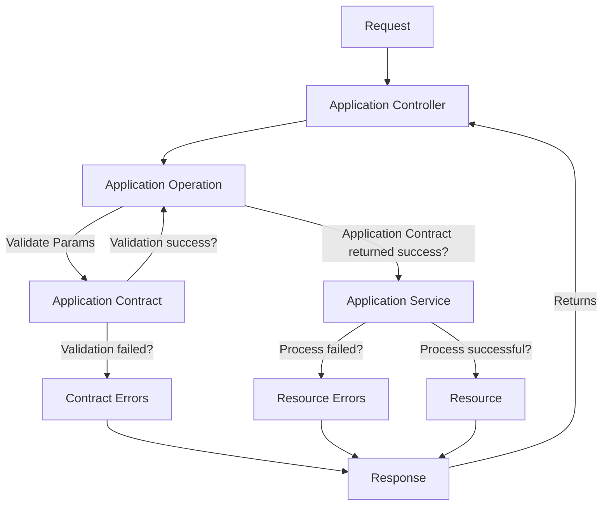

[](https://github.com/rubocop/rubocop)


[](docs/SWAGGER.md)

# Rails API Boilerplate


# How to Works?


# Documentations
- [Swagger](docs/SWAGGER.md)
- [Service generator](docs/SERVICE.md)
- [Contract generator](docs/CONTRACT.md)
- [Search & Filter & Sort](docs/RANSACK.md)

# Installation
## Prerequisites
- [Ruby](https://rvm.io/)
- [PostgreSQL](https://www.postgresql.org/)
- [Redis](https://redis.io/)

## Installation
- Install GEM dependencies:
  ```bash
  bundle install
  ```

- Create database, migrate tables and run the seed data:
  ```bash
  rails db:create
  rails db:migrate
  rails db:seed
  ```

- If you are setting up again, when you already have previous databases:
  ```bash
  rails db:reset
  ```
  `reset` is equivalent of `rails db:drop & rails db:setup`.

-  Run the server
   ```bash
   ./bin/dev
   ```

## CLIENT ID AND SECRET
- Create a new application in the [OAuth2 Provider](
- Add the `CLIENT_ID` and `CLIENT_SECRET` to the `.env` file.
```bash
rails c
app = Doorkeeper::Application.create(name: "API", redirect_uri: "http://localhost:3000")

=> #<Doorkeeper::Application:0x00000001066b69b0
 id: "03e15fef-be23-4163-ba66-04d3365425b6",
 name: "API",
 uid: "HTCoZAN6NXk_jvSNlyBelBQcCePt2aGrCzN-D4IXcoE",
 secret: "[FILTERED]",
 redirect_uri: "http://localhost:3000",
 scopes: "",
 confidential: true,
 created_at: Sat, 05 Oct 2024 09:11:48.155644000 UTC +00:00,
 updated_at: Sat, 05 Oct 2024 09:11:48.155644000 UTC +00:00>

puts "Client ID: #{app.uid}"
puts "Client Secret: #{app.secret}"

Exemple:
Client ID: HTCoZAN6NXk_jvSNlyBelBQcCePt2aGrCzN-D4IXcoE
Client Secret: zOrTDZIqc6lt6RtkpJ9xu0XzDPJiM0OTIq5ALCp_ObY
```

## FRONTEND
- Create Vite + React App
```bash
npx create-vite

Need to install the following packages:
create-vite@5.5.3
Ok to proceed? (y) y

✔ Project name: … frontend
✔ Select a framework: › React
✔ Select a variant: › TypeScript

Scaffolding project in /Users/cassiano.yasumitsu/RubymineProjects/api-template/frontend...

Done. Now run:

  cd frontend
  npm install
  npm install axios
  npm run dev
```